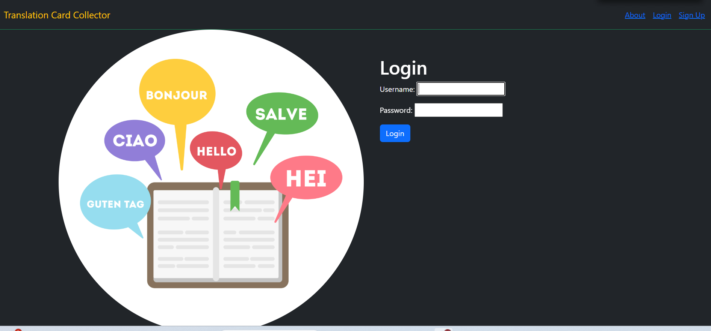
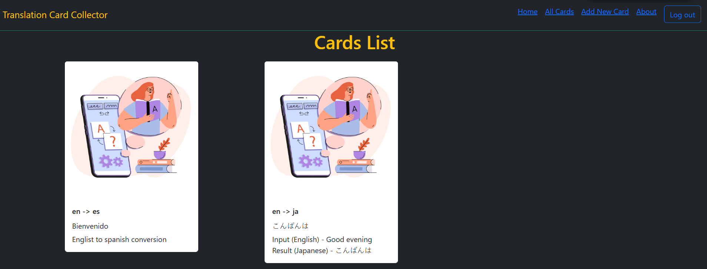

# Translator Card Collector

#### This is a Python, Django based web app with CRUD functionality to help the user translate a text input to a desired language.

## Features
* App uses Python library [Googletrans API](https://py-googletrans.readthedocs.io/en/latest/) to carry out the translation.
* The user can opt to 'Auto detect' input text language and translate it to 100+ languages 
* The user can select an input language and translate the text to the desired language.
* App makes use of Django’s built-in session-based authentication.
* App deployed on Heroku [Live](https://ga-django-app-3fb67a245cee.herokuapp.com/)
####

## Technologies Used
* Python
* Django
* Postgresql
* Bootstrap
* Googletrans API

## Steps To Install
* Clone the repo to your local folder `git clone https://github.com/pshegde123/django_translate_app.git`
* Change directory to `django-translator-app` by using command `cd django_translate_app`
* Execute command `pipenv shell`
* Execute command `python3 manage.py runserver`
* Open URL `https://127.0.0.1:8000` to visit the app page
* Visit 'Signup' page and create a user login
* Once user log in and create a new card, the 'All Cards' page will display all the created cards

* Click on a card to view details, edit note content, or to delete the card.
